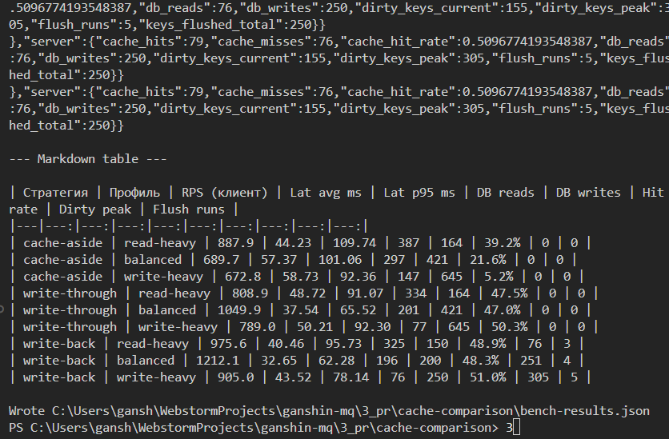
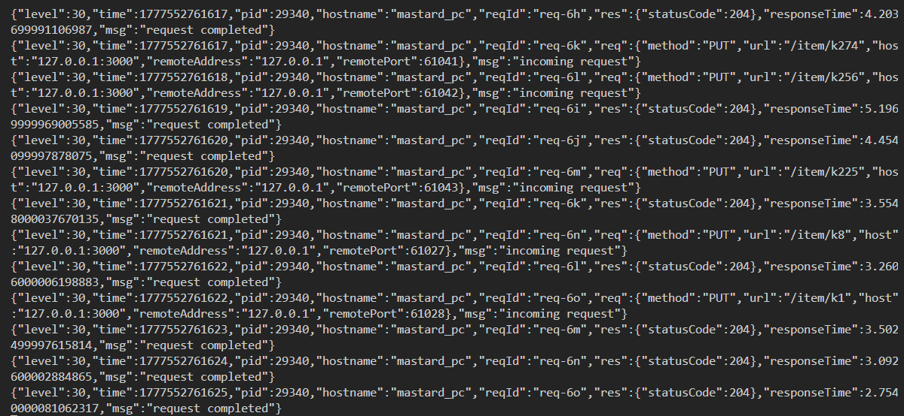

# Отчёт: сравнение типов кеширования

## Параметры прогона

| Параметр | Значение |
|----------|----------|
| Длительность (настройка матрицы), мс | 2500 |
| Целевой RPS | 40 |
| Ключей | 500 |
| Seed RNG | 42 |
| Базовый URL | http://127.0.0.1:3000 |

## Описание тестов

Один генератор нагрузки ([benchmark.ts](src/benchmark.ts)): предрасчёт списка операций (read/write + id) по seed и профилю; объём запросов = floor(duration_s * target_rps); выполнение с ограниченной параллельностью. Перед каждой ячейкой матрицы — TRUNCATE + сид + сброс Redis ([bench-matrix.ts](src/bench-matrix.ts)).

Метрики: **throughput** = успешные запросы / фактическое время прогона; **latency** — RTT на клиенте; **db_reads/db_writes** — счётчики на сервере; **hit rate** — hits/(hits+misses) на чтениях; для write-back — **dirty_keys_peak**, **flush_runs**.

## Проверка валидности

Проверки пройдены: для каждой ячейки hits+misses=reads, db_reads=misses, ok+err=planned, hit rate согласован с hits/misses; для cache-aside и write-through — db_writes равно числу HTTP-записей; для write-back объём записей в БД задаётся flush и может отличаться от числа PUT.

## Таблица результатов

| Стратегия | Профиль | Запланировано | RPS | Lat avg ms | Lat p95 ms | DB reads | DB writes | Hit rate | Dirty peak | Flush |
|---|---:|---:|---:|---:|---:|---:|---:|---:|---:|---:|
| cache-aside | read-heavy | 100 | 411.5 | 46.89 | 160.96 | 76 | 19 | 6.2% | 0 | 0 |
| cache-aside | balanced | 100 | 390.6 | 50.27 | 158.10 | 52 | 47 | 1.9% | 0 | 0 |
| cache-aside | write-heavy | 100 | 387.6 | 49.45 | 145.48 | 20 | 80 | 0.0% | 0 | 0 |
| write-through | read-heavy | 100 | 371.7 | 51.87 | 150.00 | 76 | 19 | 6.2% | 0 | 0 |
| write-through | balanced | 100 | 411.5 | 47.12 | 156.97 | 50 | 47 | 5.7% | 0 | 0 |
| write-through | write-heavy | 100 | 333.3 | 57.58 | 141.89 | 16 | 80 | 20.0% | 0 | 0 |
| write-back | read-heavy | 100 | 374.5 | 52.05 | 165.85 | 76 | 19 | 6.2% | 15 | 2 |
| write-back | balanced | 100 | 366.3 | 53.01 | 183.48 | 48 | 47 | 9.4% | 12 | 1 |
| write-back | write-heavy | 100 | 543.5 | 33.91 | 127.03 | 16 | 50 | 20.0% | 54 | 1 |

## Скриншоты

### Вывод `npm run bench:matrix` (таблица и JSON по ячейкам)

### Логи сервера (Fastify, write-back, запросы PUT)

## Выводы

### Чтение (read-heavy)

- Hit rate (read-heavy): у всех трёх стратегий совпадает (одинаковая логика чтения из кеша/БД на GET). При случайном доступе к **500** ключам доля попаданий ограничена; cache-aside при записи снимает ключ с кеша — на balanced профиле hit rate обычно ниже, чем у write-through.
- По средней задержке (ниже лучше): **cache-aside** (~46.89 ms).

### Запись (write-heavy)

- **Write-back** даёт меньше синхронных обращений к БД на путь записи (запись в Redis), нагрузка на PG снимается flush'ами; пик dirty и число flush видны в таблице.
- Максимальный клиентский RPS в прогоне: **write-back** (~543.5 req/s).

### Смешанная нагрузка (balanced)

- Компромисс latency / throughput: смотрите колонки RPS и Lat avg; ориентир по «сводной» метрике в автотексте: **write-through**.

_Выводы сгенерированы по числам из `bench-results.json`; при необходимости отредактируйте вручную._

---

_Файл сгенерирован командой npm run report. Исходные данные: bench-results.json._
