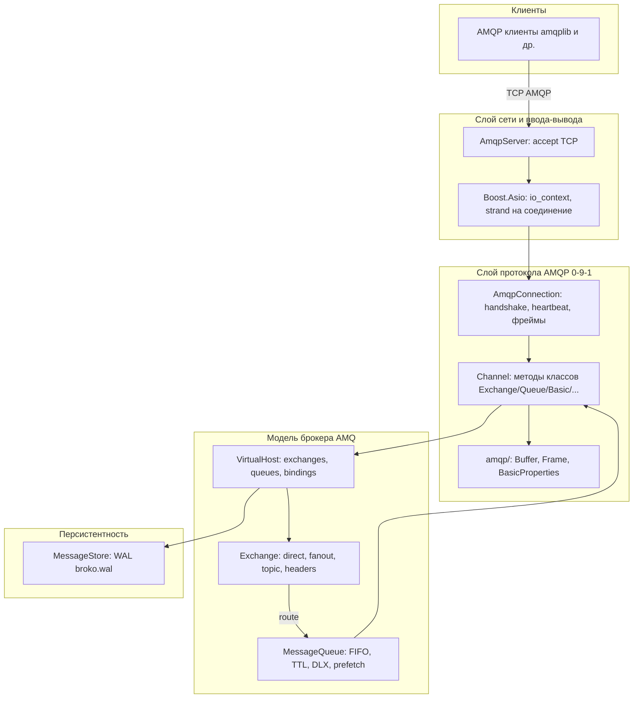

# Broko: архитектура, данные и план реализации

Документ закрывает требования **этапа 1** (проектирование и документация): схема системы, модель данных, стек с обоснованием, план разработки модулей. Исходное ТЗ курса: [MessageBrokerRequirements.md](../MessageBrokerRequirements.md).

---

## 1. Цели проекта и требования (сводка)

| Источник | Содержание |
|----------|------------|
| Цель | Брокер сообщений с pub/sub, очередями, совместимость с **amqplib** (Node.js). |
| Обязательно | Publisher/Subscriber, очереди, персистентность на диске, восстановление после рестарта, протокол **AMQP**. |
| Реализация | Язык **C++**, деплой через **Docker**. |

Подробные формулировки и этапы сдачи — в [MessageBrokerRequirements.md](../MessageBrokerRequirements.md).

---

## 2. Архитектурная схема (монолит, логические слои)

Broko — **один процесс** (монолит). Внутри выделяются слои с однонаправленными зависимостями (сверху вниз).

**Поток публикации:** клиент → TCP → `AmqpConnection` → `Channel::handleContentBody` → `VirtualHost::routeMessage` → очереди → при необходимости `MessageStore::storeMessage`.

**Поток доставки:** `MessageQueue::dispatch` → callback потребителя → (пост на strand) → `Channel::deliverMessage` → фреймы `basic.deliver` + content.

---

## 3. Структура данных

### 3.1. Терминология AMQP (топики vs очереди)

В AMQP 0-9-1 **нет отдельной сущности «топик» как в Kafka**. Есть:

| Сущность | Назначение |
|----------|------------|
| **Exchange** | Точка входа для publish; тип задаёт правило маршрутизации (**direct**, **fanout**, **topic**, **headers**). |
| **Queue** | Хранилище сообщений (FIFO в Broko; опционально приоритеты). Потребители подписываются на **очередь**. |
| **Binding** | Связь exchange ↔ queue (routing key и/или arguments). |

«Топик» в смысле курсового ТЗ обычно соответствует **routing key** при publish в **topic exchange** или имени **очереди** при публикации в default exchange.

### 3.2. Сообщение в памяти (`broker::Message`)

Реализация: [src/broker/message.h](../src/broker/message.h).

| Поле | Назначение |
|------|------------|
| `exchange`, `routing_key` | Как пришло из publish / для маршрутизации и DLX. |
| `mandatory`, `immediate` | Флаги publish (в текущей версии `immediate` отклоняется по протоколу). |
| `properties` | `BasicProperties` (см. ниже). |
| `body` | Полезная нагрузка (байты). |
| `redelivered` | Повторная доставка после reject/requeue. |
| `enqueued_at` | Для TTL. |
| `wal_id` | Идентификатор записи в WAL для durable + ack на диске. |
| `source_connection_id` | Для `no_local`. |
| `dlx_hops` | Защита от циклов DLX. |

### 3.3. Метаданные контента AMQP (`BasicProperties`)

Реализация: [src/amqp/content.h](../src/amqp/content.h). Поля по спецификации (часть опциональна): `content_type`, `content_encoding`, `headers` (field table), `delivery_mode` (1 non-persistent / 2 persistent), `priority`, `correlation_id`, `reply_to`, `expiration`, `message_id`, `timestamp`, `type`, `user_id`, `app_id`, `cluster_id`.

На wire кодируются с битовой маской присутствия полей (AMQP content header).

### 3.4. Очередь и exchange (логическая модель)

- **Очередь** (`MessageQueue`): имя, флаги durable / exclusive / auto_delete, аргументы (`x-message-ttl`, `x-max-priority`, `x-dead-letter-exchange`, …), deque сообщений, список потребителей.
- **Exchange**: имя, тип, привязки (`Binding`: queue_name, routing_key, arguments).
- **VirtualHost**: один экземпляр на брокер (`/`), словари `exchanges`, `queues`.

### 3.5. Персистентность (WAL)

Файл по умолчанию: `data/broko.wal`. Формат записей (см. [src/storage/message_store.h](../src/storage/message_store.h)):

- Запись: размер (BE32) + тип + полезная нагрузка + CRC32.
- Типы: сообщение, ack, declare queue/exchange, binding, delete, unbind и т.д.

Сообщение в записи WAL содержит id, имя очереди, exchange, routing key, закодированные properties, тело.

---

## 4. Технический стек и обоснование

| Выбор | Обоснование |
|-------|-------------|
| **C++23** | Предсказуемая производительность, контроль над памятью и latency; подходит для сетевого сервиса в production. |
| **Boost.Asio** | Стандарт де-факто для асинхронного TCP в C++; стабильный API, `strand` для упорядочивания обработки на соединение. |
| **AMQP 0-9-1** | Требование ТЗ и совместимость с **amqplib** без собственного клиентского протокола; зрелая модель exchange/queue/binding. |
| **Собственный WAL (файл)** | Персистентность без внешней СУБД в базовом контуре; append-only журнал, восстановление при старте; проще деплой. |
| **CMake** | Переносимая сборка под Linux и типичные CI. |
| **Docker / Compose** | Воспроизводимый деплой и демо-микросервисы по требованию ТЗ. |
| **Node.js + amqplib для тестов** | Прямая проверка совместимости с обязательным клиентом. |

---

## 5. План реализации (последовательность модулей)

Порядок от низа стека к функциям верхнего уровня; соответствует фактической структуре `src/`.

1. **`src/amqp/`** — примитивы протокола: `Buffer`, field table, фреймы, `BasicProperties`, ID методов.
2. **`src/broker/server` + `connection`** — TCP accept, чтение/запись фреймов, handshake, heartbeat, мультиплексирование каналов.
3. **`src/broker/channel`** — разбор методов Exchange, Queue, Basic, Confirm, Tx; publish/consume/ack.
4. **`src/broker/vhost`, `exchange`, `queue`, `consumer`, `message`** — модель AMQ, маршрутизация, очереди, доставка.
5. **`src/storage/message_store`** — WAL, запись durable-сообщений и метаданных, восстановление, compaction.
6. **`test/*.js`** — интеграционные тесты с amqplib.
7. **`docker/`** — образ и compose для демо.

Детализированный план с фазами wire/handshake/model/persistence см. также в репозитории Cursor: `.cursor/plans/amqp_message_broker_0057cdab.plan.md` (рабочий артефакт планирования).

---

## 6. Чек-лист этапа 1 (документация)

| Артефакт | Где |
|----------|-----|
| Архитектурная схема | [README.md](../README.md) (mermaid), раздел 2 этого файла |
| Структура данных | Раздел 3 этого файла + исходники `message.h`, `content.h`, `message_store.h` |
| Технический стек и обоснование | [README.md](../README.md), раздел 4 этого файла |
| План реализации | Раздел 5 этого файла |
| README: цели и требования | [README.md](../README.md) — блок «Документация и цели»; полное ТЗ — [MessageBrokerRequirements.md](../MessageBrokerRequirements.md) |

После этого набора документов разработка может вестись без дополнительных вопросов по базовой архитектуре; детали протокола уточняются по спецификации AMQP 0-9-1 и коду модулей.
